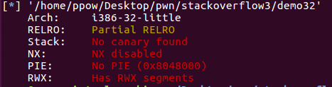

# pwn
### ret2shellcode
ubuntu查看文件属性

32位文件没有开启保护

ida打开分析文件

vul函数里声明了s局部变量，然后打印出一个字符串，调用了gets函数让我们输入，然后调用strncpy函数将局部变量的字符串拷贝到了bss段的buf。并且没有发现system和/bin/sh。

gdb调试

计算溢出字节为76.

在内存中查找"AAAA"字符串，发现在heap段和stack段以及bss段，vmmap命令查看整个程序的内存空间分布。发现有可读可写可运行的段，这些段有stack和libc中的bss段以及程序中的bss段。

所以我们思路就是写入shellcode，并利用strncpy复制到bss段。

编写exp

攻击成功

### ezret2shellcode

大体思路和上题相同但是有不一样。

查看文件属性

ida查看文件函数

创建buf局部变量，并且read0x1C字节的字符串。

gdb调试文件

计算溢出大小

构造exp

注意不能使用pwntools自带的shellcode，因为自带的生成的字节数很长，而read只读取0x1C字节的数据，所以会获取不到shell。

尝试攻击

### bjdctf_2020_babystack

查看文件属性

ida中分析代码

这里的意思就是让你输入nbytes变量的值，这个值为read数的长度。创建的buf变量所以需要nbytes变量值大一些以保证可以溢出。

gdb调试计算溢出字节

构造exp

注意这里不能使用sendline，因为read会将回车也读取到，get函数不会

尝试攻击

