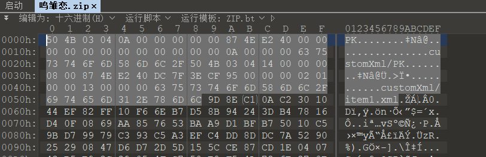
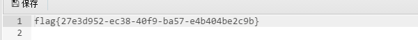

# 杂项：
1. [2021年祥云杯]鸣雏恋

下载附件拖进010查看发现是zip文件。

使用zip后缀打开在_rels里发现key和love.zip

key是零宽度字符隐写在线网站：http://330k.github.io/misc_tools/unicode_steganography.html

解密压缩包得到

写脚本将雏田头像改为1鸣人改为0(错了就反过来)

然后二进制转字符串再base64转图片得到

2. [2021西湖论剑]YUSA的小秘密

下载附件打开lsb隐写工具，查看不同色道。

发现查看不清，使用颜色反转脚本(需要的找我要)

3. snake

hex打开发现有串base64

解密得到What is Nicki Minaj's favorite song that refers to snakes?

百度搜索Nicki Minaj，发现作品

serpent加密，key(小写)：anaconda，在线网站:http://serpent.online-domain-tools.com/

4. [BJDCTF2020]认真你就输了

下载得到表格

foremost进行分离

得到flag

5. [GXYCTF2019]佛系青年

zip伪加密，自己使用工具或者手撸(需要工具找我要)

得到文档do.txt
与佛论禅在线:http://www.keyfc.net/bbs/tools/tudoucode.aspx

佛曰：遮等諳勝能礙皤藐哆娑梵迦侄羅哆迦梵者梵楞蘇涅侄室實真缽朋能。奢怛俱道怯都諳怖梵尼怯一罰心缽謹缽薩苦奢夢怯帝梵遠朋陀諳陀穆諳所呐知涅侄以薩怯想夷奢醯數羅怯諸

解密得到flag

# web
1. [SUCTF 2019]CheckIn

考点:.user.ini文件

上传.user.ini文件内容为
GIF89a
auto_prepend_file=1.gif(自己马的名字)

上传马

菜刀链接即可

注意：.user.ini它比.htaccess用的更广，不管是nginx/apache/IIS，只要是以fastcgi运行的php都可以用这个方法。
但是会被刷新掉，默认刷新时间为300秒。

2. [BJDCTF2020]Easy MD5

考点：ffifdyop、弱比较

首先burp抓包后再响应报文中看到hint暗示，输入的查询结果会被md5处理

使用ffifdyop字符串提交

之后查看源码发现弱比较。

使用md5后0e开头数即可绕过。

3. [MRCTF2020]你传你🐎呢

考点:.htaccess文件

上传一个.htaccess文件内容为
<FilesMatch "1.png">(你马名字)
SetHandler application/x-httpd-php
</FilesMatch>

上传一个马

注意：两个文件上传时都要抓包修改文件属性。

蚁剑连接即可