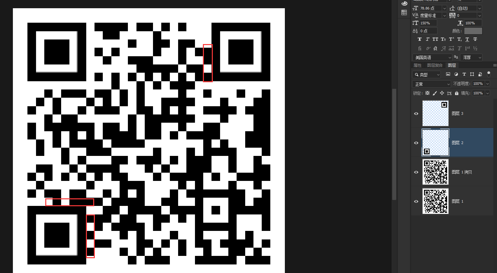

# 杂项：
1. 小明的演讲

下载后得到ppt文件,打开没有什么发现。

尝试用zip后缀打开发现有压缩包。

压缩包解压发现两个文档，第一个中文电码，在线链接:https://www.qqxiuzi.cn/bianma/dianbao.php

第二个乱码，放入010修改文件头。得到密码。

组合起来解压压缩包得到base64，解密即可。

2. fix it

ps修补定位符,要注意点位不然可能扫不出来。

扫码即可得到flag

3. 真正的CTFer

下载附件得到图片，放入010修改高度。

发现下面还有张图片

最下面中间放大仔细看有行黑字就是flag。

4. 宝宝

得到一张二维码，扫码发现扫不出来。

binwalk分离出压缩包，发现有密码，根据题名猜测密码。

readme.txt使用base64解出:离成功只差一步了....

flag添加.png后缀发现为二维码，扫码得到flag。

5. 来首歌吧
下载音频使用audacity - FilePlanet打开。发现音波规律。

手撸摩斯电码(不行就多撸几次)
..... -... -.-. ----. ..--- ..... -.... ....- ----. -.-. -... ----- .---- ---.. ---.. ..-. ..... ..--- . -.... .---- --... -.. --... ----- ----. ..--- ----. .---- ----. .---- -.-.

有时候解不出来换个摩斯电码的网站就可以了。

# web
1. hackgame2018_签到

考点:html代码审计

发现限制了输入字符。f12找到文本框html代码修改maxlength属性

输入hackergame2018即可。

2. 端午就该吃粽子

考点：php伪协议，绕过姿势

使用php伪协议得到源码php://filter/read=convert.base64-encode/resource=index.php

语句构造已经写在上面了
正则可以使用c\a\t绕过，空格使用${IFS}绕过即可。

3. WEB_ezeval

考点:绕过str_ireplace（）函数

htmlspecialchars() 函数：htmlspecialchars() 函数把预定义的字符转换为 HTML 实体。

str_ireplace() 函数：str_ireplace() 函数替换字符串中的一些字符（不区分大小写）。

解法一:拼接绕过cmd=(s.y.s.t.e.m)('cat /flag');

解法二:进制编码绕过cmd=hex2bin('73797374656d')('cat /flag');

PHP hex2bin() 函数:把十六进制值转换为 ASCII 字符.