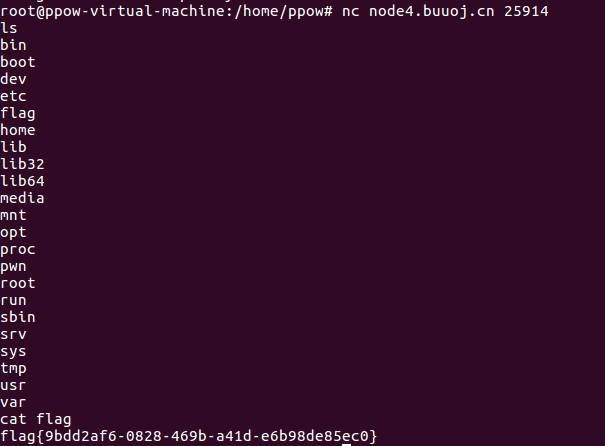
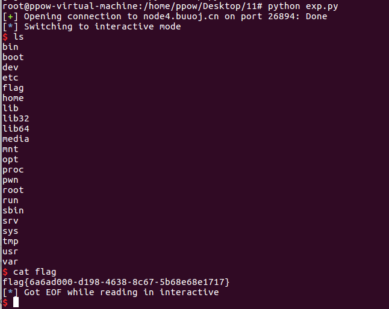

# pwn:
1. test_your_nc

信心增强题，也算pwn的最基础入门题。

在ida中查看

其中相当于在终端输入/bin/sh以获得shell

启动靶机然后nc ip地址 端口

2. rip

在ubuntu中查看保护以及文件属性

可以看到没有开启保护并且为64位的可执行程序

进入ida中查看

可以看到危险函数gets

注：get函数在pwn中是非常危险的函数！因为他可以无限制获取你输入的字符易导致大于栈空间，所以会导致栈溢出攻击(pwn)。

在函数窗口可以看到fun函数，点进查看。

发现fun函数是后门函数，存在getshell点。

ida查看s变量在栈空间的大小

一共是15字节

由此构造 exp. py

因为64位程序还有返回地址8字节所以要加上8位的垃圾数据，最后加上返回地址即可打通本地拿到shell

然后尝试远程连接，修改exp. py

如果使用原来的exp会发现本地能通远程不能通，是因为平台题目出现了变动，影响了栈平衡，所以这边返回地址要+1.

至此pwn攻击完成。

3. hello_pwn

查看文件保护和文件属性

开启了nx保护(栈不可执行)

运行程序

ida查看

分析程序的意图为：首先read你输入的数字，然后判断dword_60106C=1853186401便可跳转到sub_400686函数，否则跳出。

sub_400686函数内容

所以我们需要是dword_60106C=1853186401即可查看到flag。

查看unk_601068和dword_60106C之间的距离。

发现为4

构造exp

运行exp

发现攻击成功

修改exp准备远程攻击

攻击成功